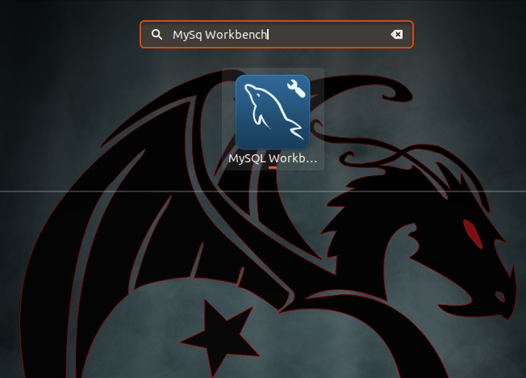
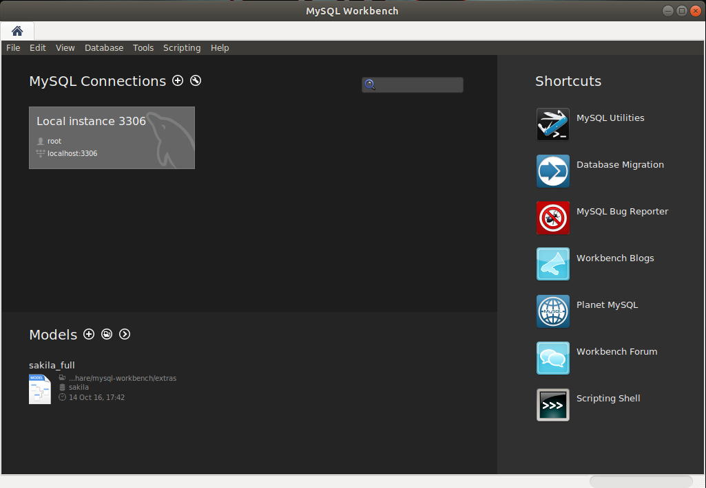
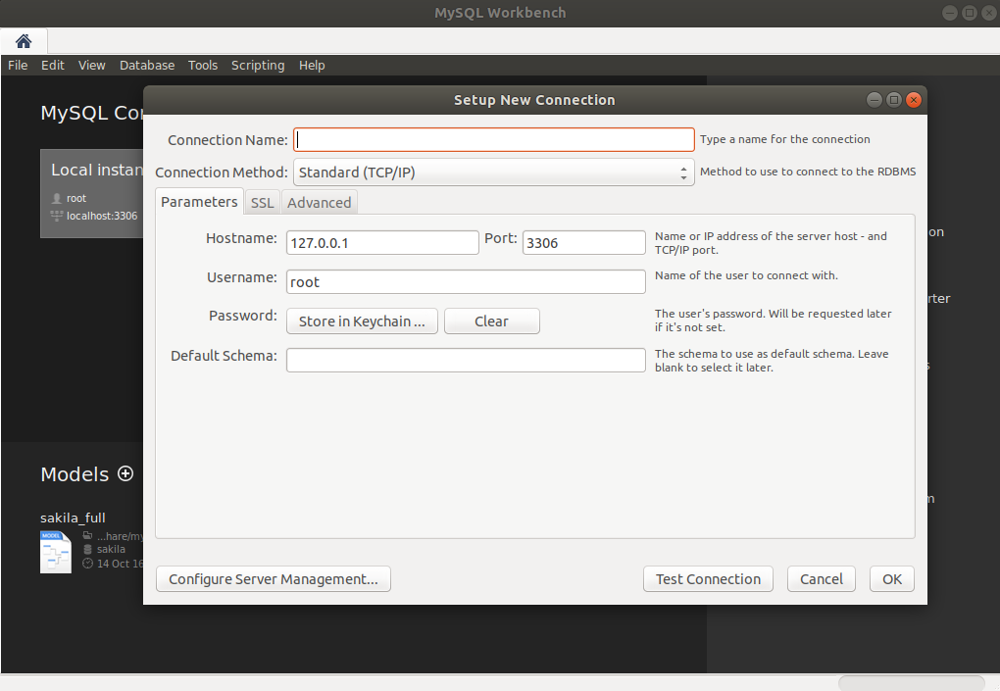
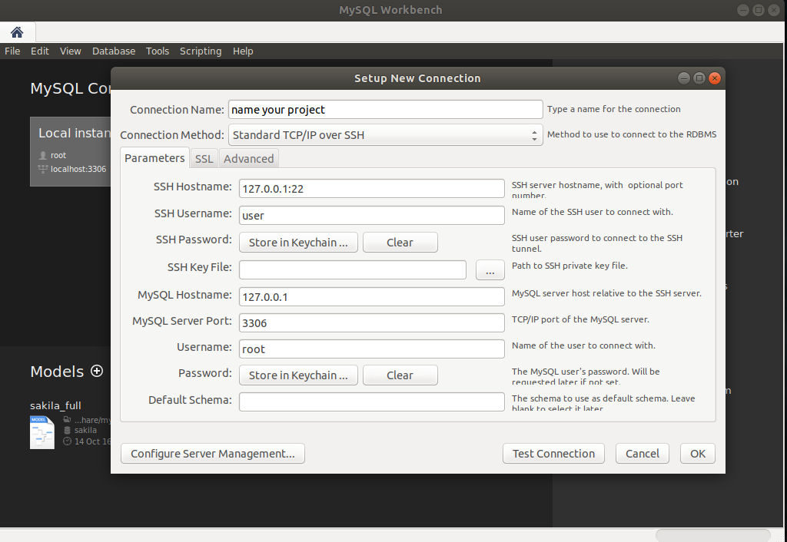
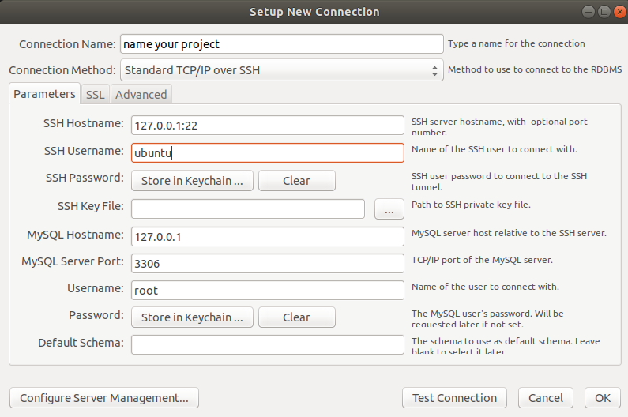

##  Configure to mysql workbench host server
First of all download to MysqlWorkbench
```
sudo apt update
```
```
sudo apt install mysql-workbench -y 
```
# Go to the show application in your system 


# Type to mysql workbench
 




# Open mysql workbench 




## And click to add conection



## Type yor name project 







## Then click to connection method and click to standerd tcp/ip over ssh

```
now add your host name =  your ip 

ssh user = name your machine name 

then click to ssh key file 
```

## Go to your .ssh file and add your key 


```
home > presh key ctrl+h >find .ssh > select key id_rsa
```

Now add host name = your host

Add user name = your db user

# Then click to 
```
password :  store in keychain pest your db password
```


# Now click to test conection
